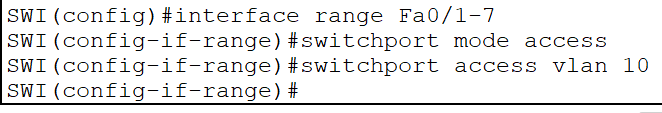
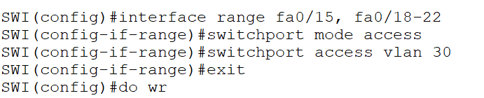
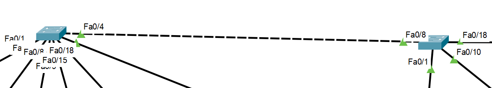

Asignación de puertos por grupo a VLAN:

Asignación de puertos por grupo + individual a VLAN:

`Do wr` para guardar:

`VLAN {numeroVLAN}` -> crear VLAN  
`no VLAN` -> eliminar VLAN

Forma de conectar VLAN's: con cable cruzado entre switch pero no es eficiente.

Enlace troncal:

`NO CDP RUN`: comando para evitar alerta de estado.

Tipos de VLAN: nativa, administración, de datos, default, voz.

Beneficios de VLAN: centralizar y segmentar, seguridad, reduce el broadcast.