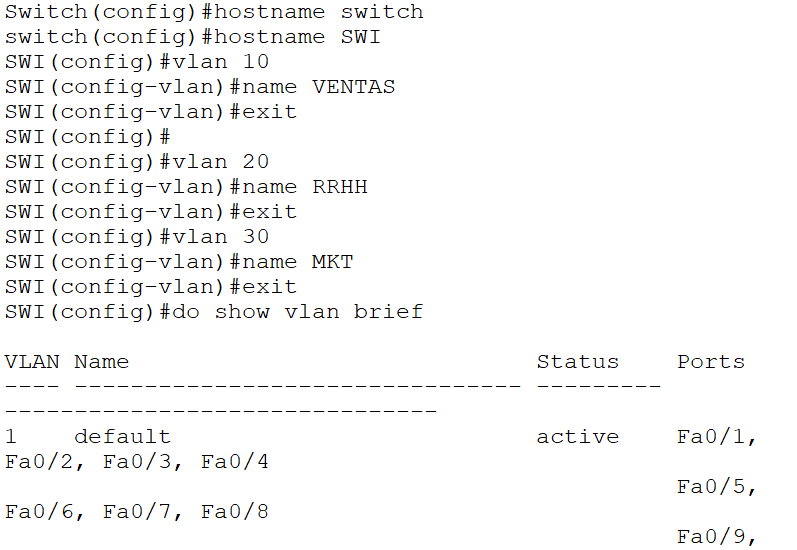
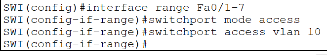
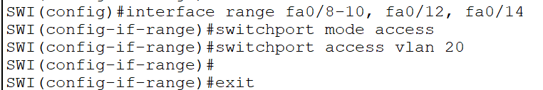
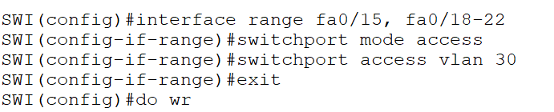
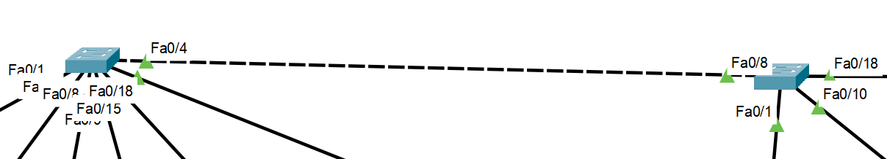
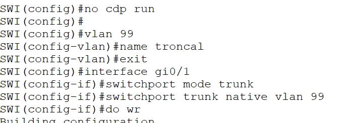

`do show vlan brief`: muestra el estado de las vlan, se agrega el do porque estás en global

Asignación de puertos por grupo a VLAN:

Asignación de puertos por grupo + individual a VLAN:

`Do wr` para guardar:

`VLAN {numeroVLAN}` -> crear VLAN  
`no VLAN` -> eliminar VLAN

Forma de conectar VLAN's: con cable cruzado entre switch pero no es eficiente.

Enlace troncal:

`NO CDP RUN`: comando para evitar alerta de estado.

Tipos de VLAN:
- Nativa
- Administración
- De datos
- Default
- Voz

Beneficios de VLAN:
- Centralizar y segmentar
- Seguridad
- Reduce el broadcast