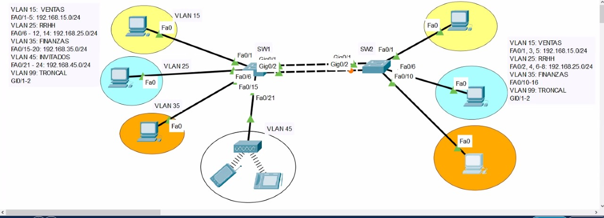
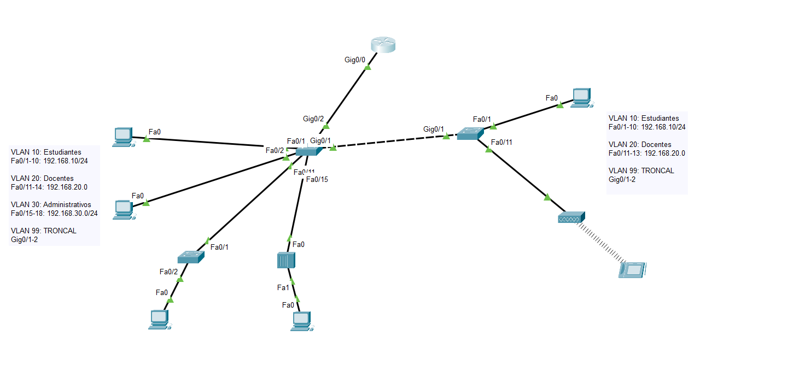
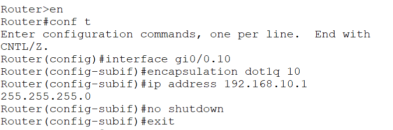

Enlace troncal: permite comunicar VLANs del mismo tipo, viajan con una etiqueta que le da la VLAN.

En cable giga, entre switches se usa: 
`switchport mode trunk`
`switchport trunk allowed vlan {List vlans}`

1 dominio broadcast por cada VLAN.

En este caso son 4 VLANs, por eso hay solo 4 dominios broadcast, no hay 7 VLANs.

Solo las VLAN de datos generan broadcast, la nativa como la 99 no genera.

Sem3_s2: INTER-VLAN
Diagrama:

Configuración de una subinterfaz en un router:

Luego de configurar cada subinterfaz (es una subinterfaz por VLAN), haces no shutdown al gi0/0.