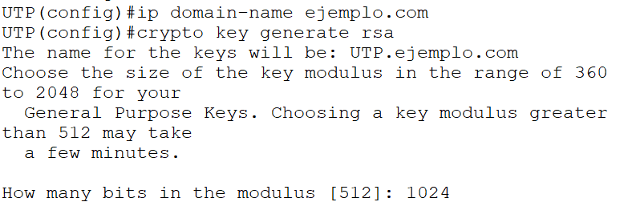
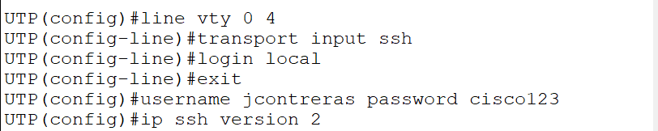
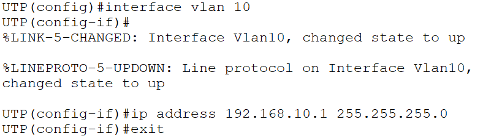

Similitudes entre switch L3 y router:

- Switch multicapa: para enrutamiento inter-VLAN cuando son más VLANs.
- Router: no es específico para enrutamiento inter-VLAN pero se puede.
- Ambos trabajan en capa 3, enrutan paquetes.

Diferencias entre switch L3 y router:
- El router hace enrutamiento LAN y WAN.
- El switch L3: no hace enrutamiento WAN, solo LAN.
- En router creabas subinterfaces, en switch L3 creas SVI.
- El switch tiene más puertos disponibles para hacer enrutamiento inter-VLAN.
- El switch L3 tiene una velocidad de procesamiento más rápida.
- Ahora con switch L3, ya no hay troncal, es directo.

Configurar SSH:
se le pone `1024`.

Entramos al line:

Switch L3: tiene hasta 5 conexiones en VTY.

Crear SVI: se crea uno por cada VLAN.

Con este comando escalas el SW2 a capa 3:
`ip routing`