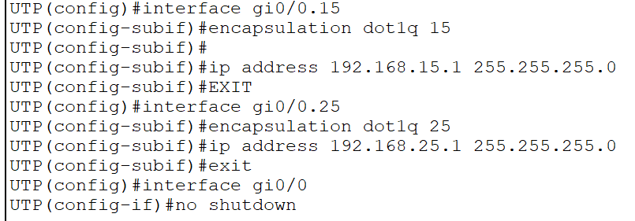
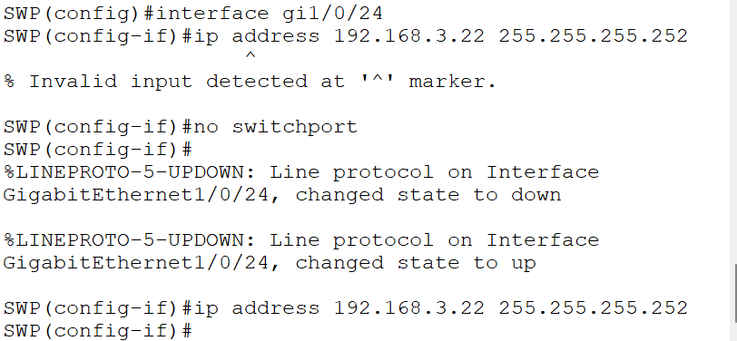
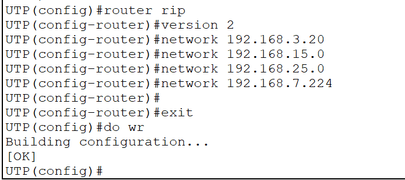
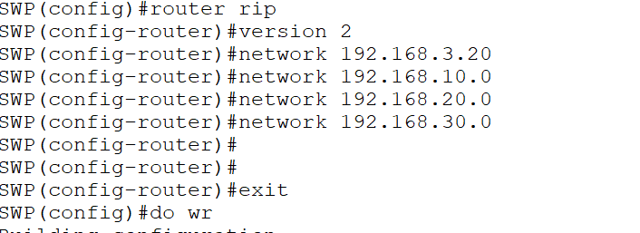

Subinterfaces en router:

Solo se configura IP a las interfaces, subinterfaces y SVIs.
A un puerto no se le asigna IP.

Escalar puerto a interfaz:

`show ip route`:
mostrar tabla de enrutamiento.

Para compartir tabla de enrutamiento:

Router:

Switch:

