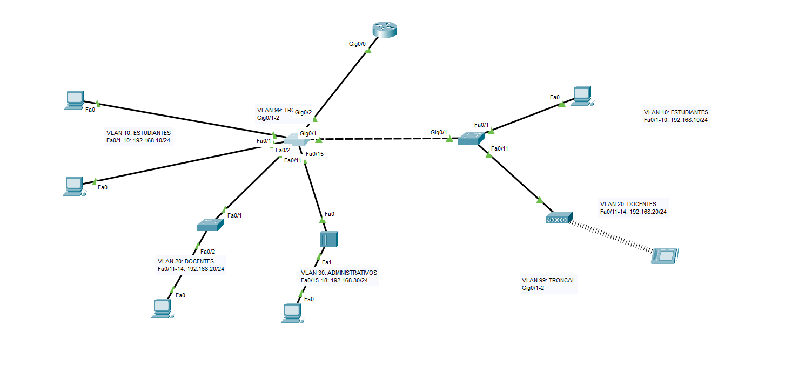

Pasos para inter-VLAN con 2 switches y un router:
Diagrama (Se conectan entre VLANs):

1. Crear las VLANs en ambos switches.
2. Asignar puertos a esas VLANs.
3. Hacer el `switchport mode access`, `access vlan` a los puertos FastEthernet.
4. Hacer el `switchport mode trunk`, `trunk native vlan 99` -> la troncal.
5. Hacer el `switchport mode trunk`, `trunk allowed vlan {lista de VLANs}` -> a los puertos GigabitEthernet de ambos switches.
6. Configurar IPs a los equipos.