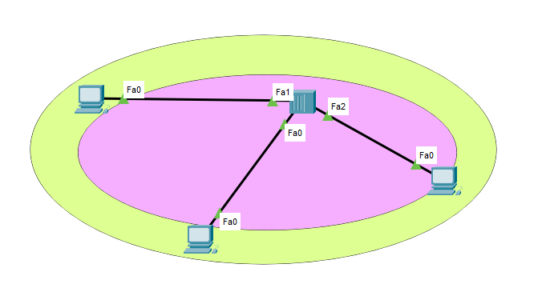
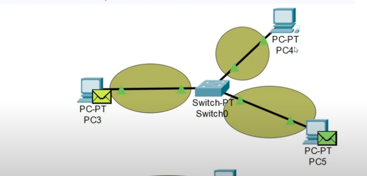
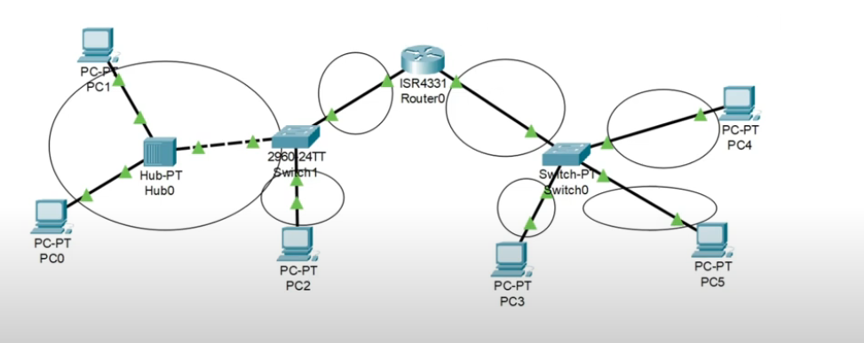
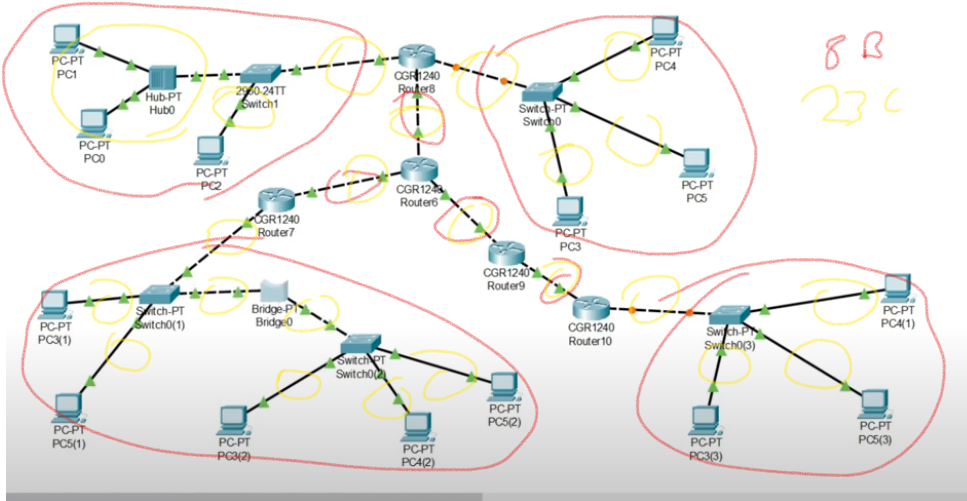
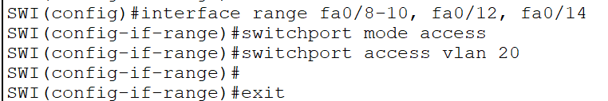
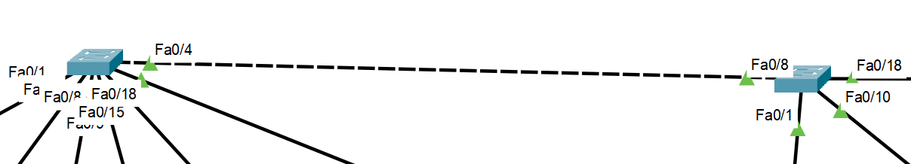
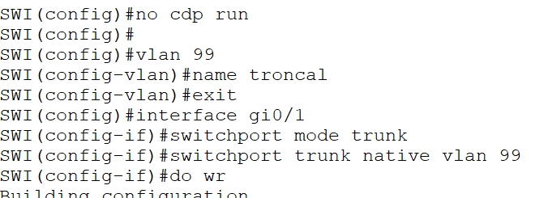
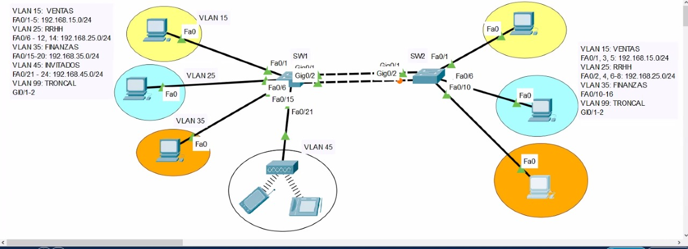
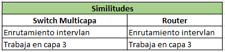
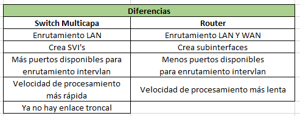

**PRE:**
PDU (capas):
1 bits
2 tramas
3 paquetes
4 segmento
5-6-7 datos

Dispositivos:
Capa 3: Un dominio de colisión por cada conexión y un dominio broadcast por cada conexión.
Capa 2: Un dominio de colisión por cada conexión.
Capa 1: Un dominio de colisión para todas sus conexiones.

Ejemplos:
1 solo dominio broadcast, 1 solo dominio de colisión:

1 solo dominio broadcast, 3 dominios de colisión:

2 dominios broadcast, 7 dominios de colisión:

8 dominios broadcast, 23 dominios de colisión:

Asignación de puertos por grupo + individual a VLAN:

Forma de conectar VLANs: con cable cruzado entre switches pero no es eficiente:

Enlace troncal:

Ejemplo: (4 dominios broadcast por ser 4 VLANs):

**COMANDOS:**
`do` -> cuando estés en config global y quieras ejecutar
`show vlan brief` -> muestra el estado de las VLAN
`vlan {numerovlan}` -> crear VLAN
`name {nombre vlan}` -> da el nombre a la VLAN
`no vlan` -> eliminar VLAN
`no cdp run` -> comando para evitar mensaje
`interface range fa0/{rango}` -> asignación de puertos por grupo
`interface fa0/{N°}` -> asignación de puerto individual
`switchport mode access` -> configura el puerto en modo acceso (significa que el puerto pertenece a una única VLAN)
`switchport access vlan {n°vlan}` -> asigna el puerto configurado en modo acceso a una VLAN
`switchport mode trunk` -> configura el puerto en modo trunk (trunk puede llevar el tráfico de múltiples VLANs)
`switchport trunk native vlan 99` -> establece la VLAN nativa en el puerto trunk
`wr` -> abreviatura para `copy running-config startup-config`
`switchport trunk allowed vlan {vlan1,vlan2,etc}` -> se hace en los puertos gig de los switches, inter-VLAN
`no switchport` -> upgrade from switchport to interface
`show ip route` -> mostrar tabla de enrutamiento
`line console 0 + password {passw} + login` -> contraseña para acceder a la consola
`enable secret {passw}` -> contraseña para acceder al enable
`line vty 0 4 + password {passw}` -> contraseña para el acceso remoto

Cuando se le asigna una IP a un switch: cuando quieras trabajarlo de forma remota (debes configurar ambos IP y el gateway).

Telnet utiliza el puerto 23.
SSH utiliza el puerto 22.

**Tipos de VLAN: (DANVD)**
- Datos
- Administración
- Nativa
- Voz
- Default

**Beneficios de usar VLAN:**
- Centralizar y segmentar
- Seguridad
- Reduce el broadcast

**Enlace troncal:** permite comunicar VLANs del mismo tipo, viajan con una etiqueta que le da la VLAN.

En cable giga, entre switches se usa: 
`switchport mode trunk`
`switchport trunk allowed vlan 15,25,35`

1 dominio broadcast por cada VLAN.
Solo las VLAN de datos generan broadcast.

Ahora con switch L3, ya no hay troncal, es directo.
Switch L3: tiene hasta 5 conexiones en VTY.

Solo se configura IP a las interfaces, subinterfaces y SVIs.
A un puerto no se le asigna IP.

Escalar puerto a interfaz: `no switchport`
Escalar el switch a capa 3: `ip routing`