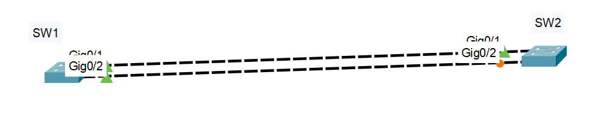
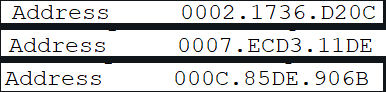
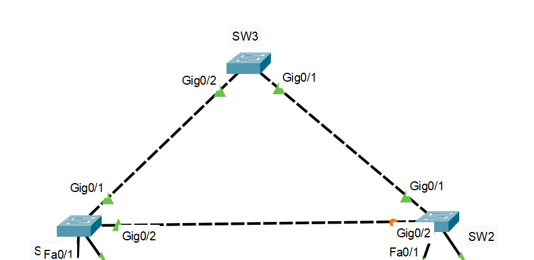

**STP: Spanning Tree Protocol**

Asegurar la redundancia de cables.

Qué genera un bucle de capa 2: Puede provocar inestabilidad en la tabla de direcciones MAC, saturación de enlaces y alta utilización de CPU en switches y dispositivos finales, lo que hace que la red se vuelva inutilizable.

Muchas inundaciones se le llama Broadcast Storm (tormenta de difusión), cuando pasa esto se deshabilita la red.

Bucles, paquetes redundantes, broadcast.

STP escoge a uno, llamado puente raíz o root bridge, este mismo bloquea un puerto lógicamente.

El cálculo STP demora 30 segundos, lo hace ni bien lo conectas, cuando está pasando de naranja a verde, intercambia los BPDU.

El root bridge en el ejemplo: SW1 (porque tiene todos los puertos activados).

En redes conmutadas ya no es PDU, ahora es BPDU: Bridge Protocol Data Unit -> Unidades de Datos de Protocolo de Puente.

Cada BPDU tiene una ID de puente (BID).

**Cómo identifico el root bridge:** **FIJA**

El que tenga prioridad más baja (0-61440) será el root bridge, si hay empate, compara las VLANs.

La prioridad por defecto de un switch es 32,768.

Por VLAN, si hay empate en VLANs, lo compara por MAC, la que sea menor tendrá el BID menor y por ende será el root bridge.

Ejemplo de 3 switches:
Cuando ya se igualan en prioridad y VLAN, se compara por MAC (se escoge la menor):

Recomendación: elegir por MAC es la última opción.

**Roles de un puerto:**
- Raíz -> root
- Designado -> dseg
- Alternativo -> altn o bloqueado

**Estado de un puerto:**
- Reenvío -> forward -> FWD
- Aprender -> learning -> LRN
- Escuchar -> listening -> LSN
- Bloqueado -> block -> BLK

Puerto raíz: es un puerto más cercano al root bridge.

Solamente puede haber un puerto raíz por switch en los switches que no son root bridge.

Ejemplo:
Si el SW3 es root bridge:

El puerto raíz del SW1 es: `Gi0/1`
El puerto raíz del SW2 es: `Gi0/1`

El resto de puertos son puertos designados.

Cada segmento entre dos switches tendrá un puerto designado.

Fija => práctica:
Asigna los roles de puertos sabiendo el root bridge.