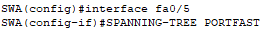
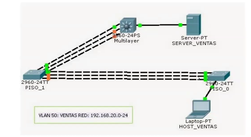
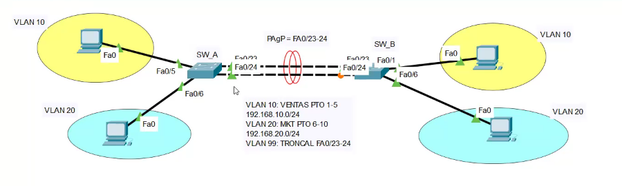
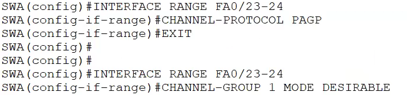
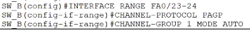
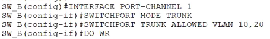
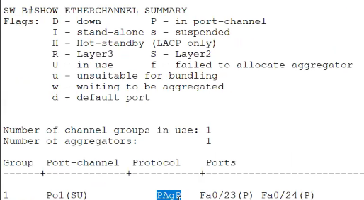
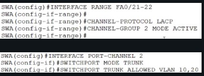

Un puerto demora 30s en habilitarse.

STP:

Lo convierte a un puerto rápido, solo es recomendable cuando se quiere direccionar las IP en PC's.

- **Switch Raiz:** PISO_0
- **Puerto raiz:** Es un puerto que se conecta directo al swicth raiz(en este caso el que va del **PISO_1** al **PISO_0**)
- **Puerto designado** (color verde): Puertos que envian y reciben paquetes
- **Puerto alternativo o bloqueado**(color naranja): Se encuentra cerca o en el switch raíz.

**EtherChannel**
Es unir varios enlaces físicos y tener un solo enlace lógico, ganas:
- Mayor ancho de banda
- Puede habilitar puertos

**A ese enlace lógico se le denomina:**
> Canal de puertos o Interfaz de canal

**Restricciones:**
- Para aplicar EtherChannel entre dos switch, los puertos deben ser iguales en ambos lados(fast || gig).
- Los puertos tienen que pertenencer a la misma VLAN.
- Misma configuración de dúplex

Configuramos el EtherChannel en el switch raíz, PUENTE RAÍZ.

Los EtherChannel se pueden formar por medio de una negociación con uno de estos protocolos(Protocolos de negociación automática):
- PAgP: Port Aggregation Protocol
- LACP: Link Aggregation Control Protocol

**PAgP:**
Tres formas de trabajo:
- Encendido
- Deseable
- Automático

**LACP:**
Tres formas de trabajo:
- Encendido
- Activo
- Pasivo

>Vamos a lo práctico:

SW_A:
Se configura en modo deseable(y se llama "1"):

Luego a este puerto lógico se le configuró para troncal:

SW_B:
Se configuró en modo automático(y se le puso de nombre "1"):

Luego como troncal:

> Show etherchannel summary: Muestra una línea de información por canal de puerto.

Con LACP:

