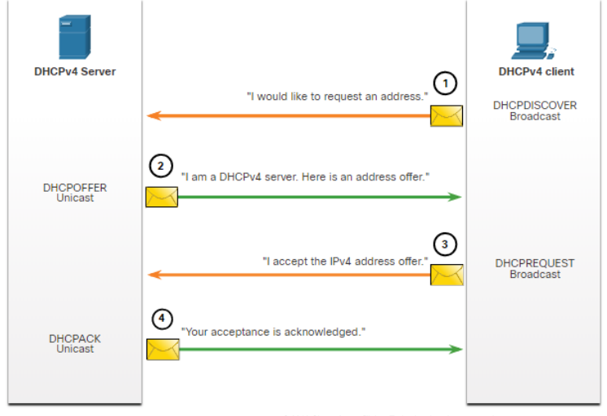
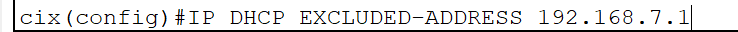
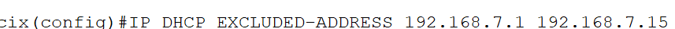
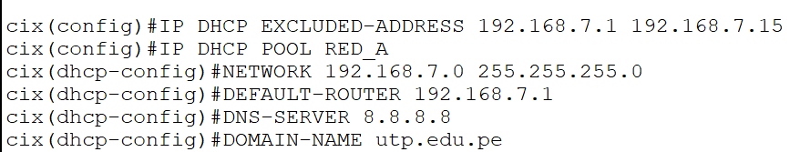
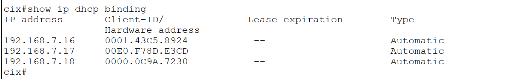
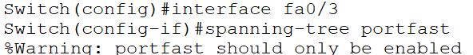

DHCPv4 asigna dinámicamente las direcciones IP, de manera consecutiva.

Los hosts arriendan las direcciones IP, cuando caduca (típicamente dura 24h) se le tiene que asignar una nueva, normalmente se le asigna la misma.

**4 pasos para obtener un arrendamiento (IPv4):**
- DHCP DISCOVER
- DHCP OFFER
- DHCP REQUEST
- DHCP ACK

Excluir una sola dirección para DHCP:

Para excluir por rango:

Asignar IPs automáticamente:

Para que se conecte automáticamente y no haga sublearning:

