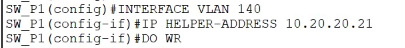
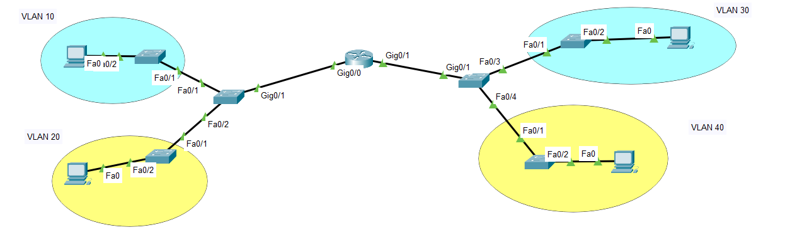
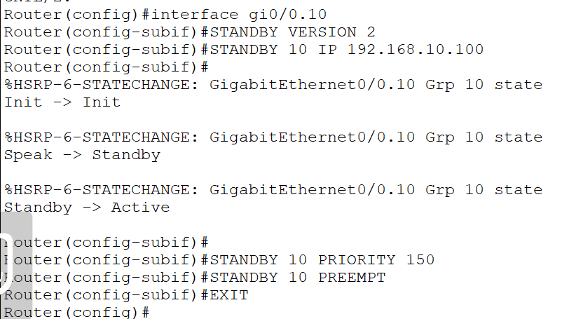
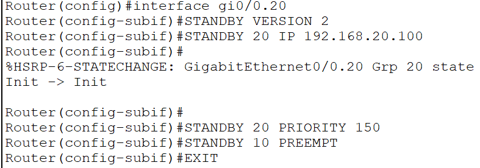

_s01
Revisar, es más práctica que teórica.

Se hace por cada vlan 

_s02
Ejemplo solo con vlans y subinterfaces:

Redundancia de primer salto

Activo o reserva
El activo es el que está funcionando constantemente
Y el de reserva es por si llega a fallar el 

HSRP: Es un protocolo que evita la pérdida de acceso externo a la red si es que llega a fallar el router predeterminado(activo)

Se utiliza en un grupo de routers(=+2)

El que asume el activo si es que cae el router predeterminado, es el que tiene la IP más alta.

Estados de HSRP:
- Inicial
- Aprender
- Escuchar
- Hablar
- En espera

Por defecto, la prioridad HSRP es 100.

Ejemplo: Si tienes un router con HSRP 100 y otro con HSRP 101, el 101 será el activo.

Si son iguales, el que tenga la IP más alta será el activo.

