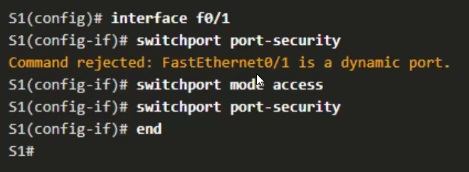
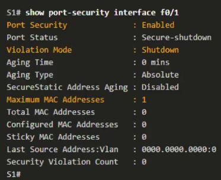
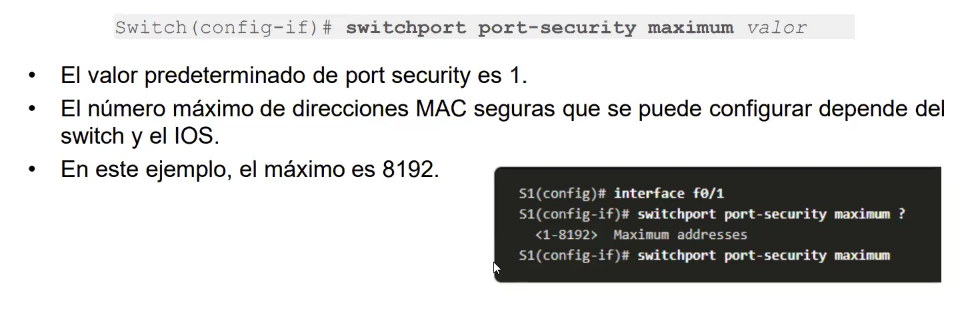
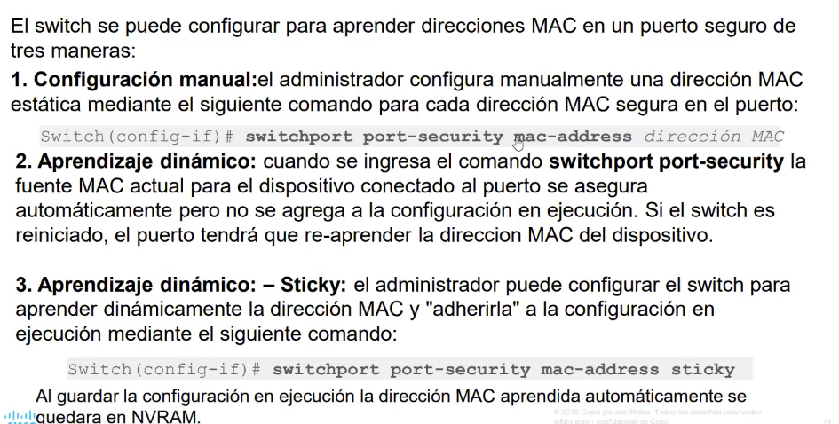
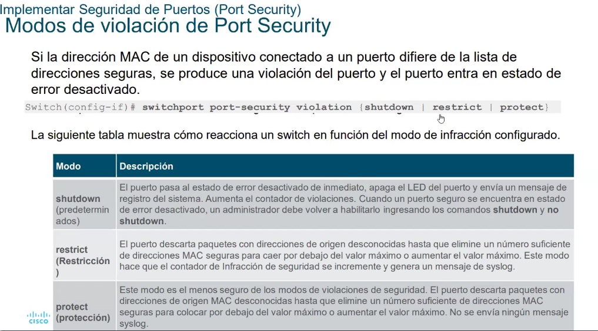

La primera forma de establecer seguridad en un switch:
los puertos no utilizados, deshabilitalos
>shutdown

El método más simple y eficaz para evitar ataques por saturación de la tabla de direciones MAC es habilitar el: 
>port security

Activación:

Mostrar la configuración de seguridad del puerto:

La cantidad máximo de direcciones MAC que puede soportar un switch 2960: 2^13 || 8192

**Vencimiento del Port Security:**
**- Absoluta:** Las direcciones seguras en el puerto se eliminan después del tiempo de caducidad específicado.
**- Inactiva:** Las direcciones seguras en el puerto se eliminan si están inactivas durante un tiempo específico.

Modos de infracción: 

