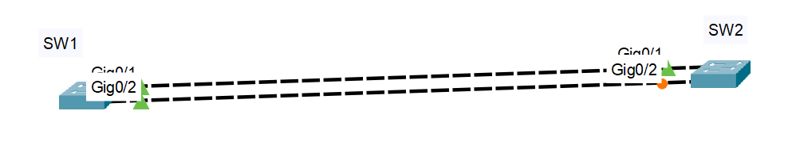
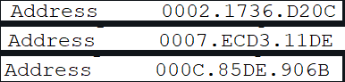
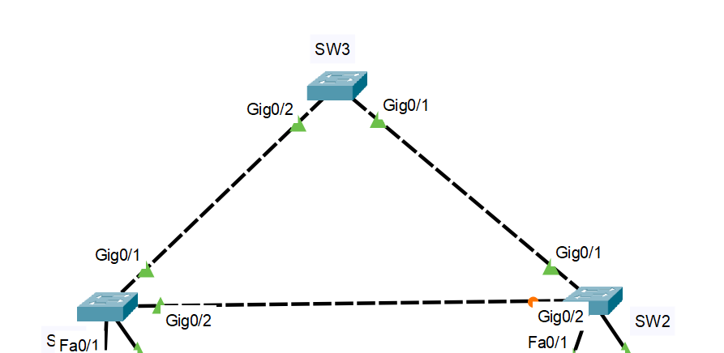
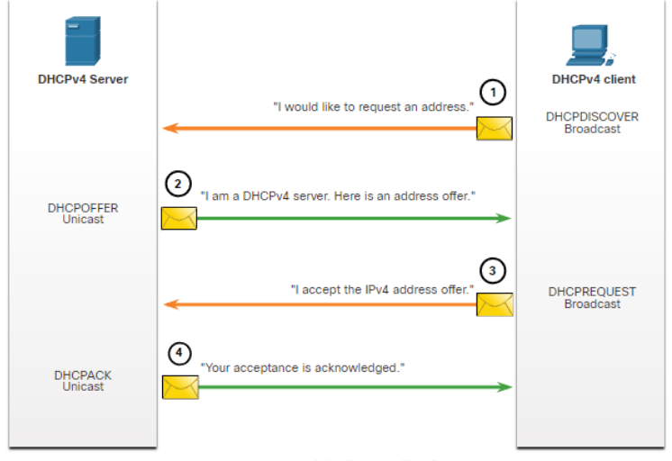
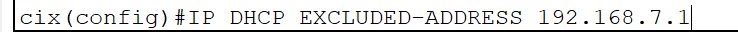
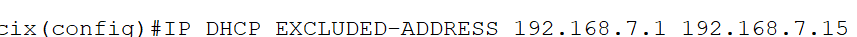
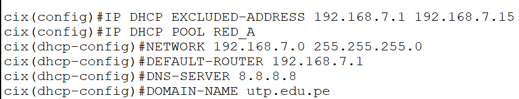
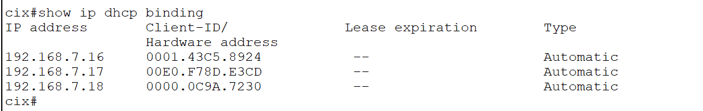
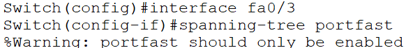

**WEEK 06**

**STP: Spanning Tree Protocol**

Asegurar la redundancia de cables.

Qué genera un bucle de capa 2: Puede provocar inestabilidad en la tabla de direcciones MAC, saturación de enlaces y alta utilización de CPU en switches y dispositivos finales, lo que hace que la red se vuelva inutilizable.

Muchas inundaciones se le llama Broadcast Storm (tormenta de difusión), cuando pasa esto se deshabilita la red.

Bucles, paquetes redundantes, broadcast.

STP escoge a uno, llamado puente raíz o root bridge, este mismo bloquea un puerto lógicamente.

El cálculo STP demora 30 segundos, lo hace ni bien lo conectas, cuando está pasando de naranja a verde, intercambia los BPDU.

El root bridge en el ejemplo: SW1 (porque tiene todos los puertos activados).

En redes conmutadas ya no es PDU, ahora es BPDU: Bridge Protocol Data Unit -> Unidades de Datos de Protocolo de Puente.

Cada BPDU tiene una ID de puente (BID).

**Cómo identifico el root bridge:** **FIJA**

El que tenga prioridad más baja (0-61440) será el root bridge, si hay empate, compara las VLANs.

La prioridad por defecto de un switch es 32,768.

Por VLAN, si hay empate en VLANs, lo compara por MAC, la que sea menor tendrá el BID menor y por ende será el root bridge.

Ejemplo de 3 switches:
Cuando ya se igualan en prioridad y VLAN, se compara por MAC (se escoge la menor):

Recomendación: elegir por MAC es la última opción.

**Roles de un puerto:**
- Raíz -> root
- Designado -> dseg
- Alternativo -> altn o bloqueado

**Estado de un puerto:**
- Reenvío -> forward -> FWD
- Aprender -> learning -> LRN
- Escuchar -> listening -> LSN
- Bloqueado -> block -> BLK

Puerto raíz: es un puerto más cercano al root bridge.

Solamente puede haber un puerto raíz por switch en los switches que no son root bridge.

Ejemplo:
Si el SW3 es root bridge:

El puerto raíz del SW1 es: `Gi0/1`
El puerto raíz del SW2 es: `Gi0/1`

El resto de puertos son puertos designados.

Cada segmento entre dos switches tendrá un puerto designado.

Fija => práctica:
Asigna los roles de puertos sabiendo el root bridge.

**WEEK 07**

Un puerto demora 30s en habilitarse.

STP:

Lo convierte a un puerto rápido, solo es recomendable cuando se quiere direccionar las IP en PC's.

- **Switch Raiz:** PISO_0
- **Puerto raiz:** Es un puerto que se conecta directo al swicth raiz(en este caso el que va del **PISO_1** al **PISO_0**)
- **Puerto designado** (color verde): Puertos que envian y reciben paquetes
- **Puerto alternativo o bloqueado**(color naranja): Se encuentra cerca o en el switch raíz.

**EtherChannel**
Es unir varios enlaces físicos y tener un solo enlace lógico, ganas:
- Mayor ancho de banda
- Puede habilitar puertos

**A ese enlace lógico se le denomina:**
> Canal de puertos o Interfaz de canal

**Restricciones:**
- Para aplicar EtherChannel entre dos switch, los puertos deben ser iguales en ambos lados(fast || gig).
- Los puertos tienen que pertenencer a la misma VLAN.
- Misma configuración de dúplex

Configuramos el EtherChannel en el switch raíz, PUENTE RAÍZ.

Los EtherChannel se pueden formar por medio de una negociación con uno de estos protocolos(Protocolos de negociación automática):
- PAgP: Port Aggregation Protocol
- LACP: Link Aggregation Control Protocol

**PAgP:**
Tres formas de trabajo:
- Encendido
- Deseable
- Automático

**LACP:**
Tres formas de trabajo:
- Encendido
- Activo
- Pasivo

>Vamos a lo práctico:

SW_A:
Se configura en modo deseable(y se llama "1"):

Luego a este puerto lógico se le configuró para troncal:

SW_B:
Se configuró en modo automático(y se le puso de nombre "1"):

Luego como troncal:

> Show etherchannel summary: Muestra una línea de información por canal de puerto.

Con LACP:

DHCPv4 asigna dinámicamente las direcciones IP, de manera consecutiva.

Los hosts arriendan las direcciones IP, cuando caduca (típicamente dura 24h) se le tiene que asignar una nueva, normalmente se le asigna la misma.

**4 pasos para obtener un arrendamiento (IPv4):**
- DHCP DISCOVER
- DHCP OFFER
- DHCP REQUEST
- DHCP ACK

Excluir una sola dirección para DHCP:

Para excluir por rango:

Asignar IPs automáticamente:

Para que se conecte automáticamente y no haga sublearning:

**WEEK 08**

_s01
Revisar, es más práctica que teórica.

Se hace por cada vlan 

_s02
Ejemplo solo con vlans y subinterfaces:

Redundancia de primer salto

Activo o reserva
El activo es el que está funcionando constantemente
Y el de reserva es por si llega a fallar el 

HSRP: Es un protocolo que evita la pérdida de acceso externo a la red si es que llega a fallar el router predeterminado(activo)

Se utiliza en un grupo de routers(=+2)

El que asume el activo si es que cae el router predeterminado, es el que tiene la IP más alta.

Estados de HSRP:
- Inicial
- Aprender
- Escuchar
- Hablar
- En espera

Por defecto, la prioridad HSRP es 100.

Ejemplo: Si tienes un router con HSRP 100 y otro con HSRP 101, el 101 será el activo.

Si son iguales, el que tenga la IP más alta será el activo.

**WEEK 09**

La primera forma de establecer seguridad en un switch:
los puertos no utilizados, deshabilitalos
>shutdown

El método más simple y eficaz para evitar ataques por saturación de la tabla de direciones MAC es habilitar el: 
>port security

Activación:

Mostrar la configuración de seguridad del puerto:

La cantidad máximo de direcciones MAC que puede soportar un switch 2960: 2^13 || 8192

**Vencimiento del Port Security:**
**- Absoluta:** Las direcciones seguras en el puerto se eliminan después del tiempo de caducidad específicado.
**- Inactiva:** Las direcciones seguras en el puerto se eliminan si están inactivas durante un tiempo específico.

Modos de infracción: 

